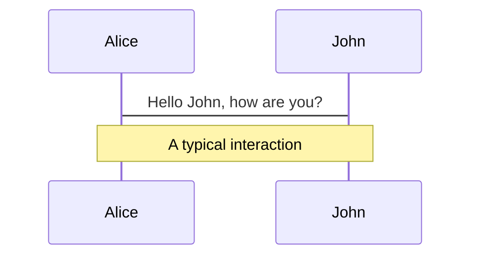
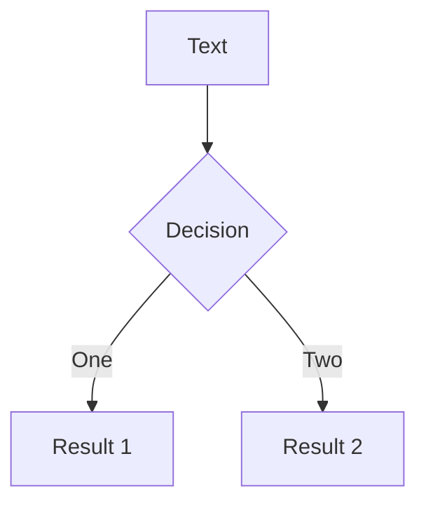
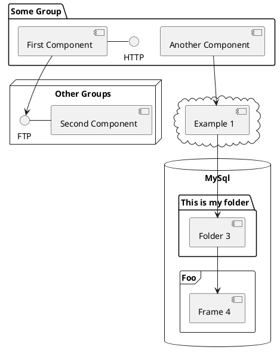

---
# try also 'default' to start simple
theme: vuetiful
# random image from a curated Unsplash collection by Anthony
# like them? see https://unsplash.com/collections/94734566/slidev
background: https://source.unsplash.com/collection/94734566/1920x1080
# apply any windi css classes to the current slide
class: 'text-center'
# https://sli.dev/custom/highlighters.html
highlighter: shiki
# show line numbers in code blocks
lineNumbers: false
# some information about the slides, markdown enabled
info: |
  ## Slidev Starter Template
  Presentation slides for developers.

  Learn more at [Sli.dev](https://sli.dev)
# persist drawings in exports and build
drawings:
  persist: false
---

# Vue3 Virtual DOM 性能优化

[戴威 / Vue.js team member ](https://github.com/edison1105) 

<div class="pt-12">
  <span @click="$slidev.nav.next" class="px-2 py-1 rounded cursor-pointer" hover="bg-white bg-opacity-10">
    Press Space for next page <carbon:arrow-right class="inline"/>
  </span>
</div>

---

# Virtual DOM 性能优化

- **组件的工作原理**
    - 编译阶段
    - 运行时
- **传统 Diff 算法存在的问题** 
    - 性能的浪费
    - 思考如何优化
- **Virtual DOM 的重构**
    - 什么是 BlockTree
    - PatchFlags 的作用
- **Diff 算法的改进**
    - diff的整个流程 
    - 优化模式

--- 

# 组件是如何工作的

  - 编译阶段
    - Parse 模板字符串 -> AST
    - Transform 对 AST 进行转换
    - Generate AST -> render 函数

---

# 组件是如何工作的
  - 运行时
    - 数据响应式处理
    - render 阶段，render 执行函数返回 VNode
    - mount 阶段，VNode 渲染成 HTML
    - patch 阶段，响应式数据变化，render 函数重新执行，拿到新的 VNode,新旧 VNode 对比，更新 HTML
---

# 组件的更新过程是怎样的
  - patch 阶段 

---

# 传统 Diff 算法
介绍diff算法

---

# 有什么缺点
patch过程中所有节点，属性都需要diff

---

# 思考
该如何做才能避免
- 静态标记

---

# Virtual DOM 的重构
模板的好处
什么是Block
Block 跟 children的关系

---

# 什么样的节点可以作为 Block
结构稳定的节点

---

# 结构稳定的Fragment
    - v-for 表达式是常量
---

# 结构稳定的Fragment
    - 多个根元素
---

# 结构稳定的Fragment
    - 插槽出口
---

# 结构稳定的Fragment
    - template v-for
---

# 结构不稳定的节点
    - v-if
    - v-for

---

# v-if 节点作为Block
截图分析

---

# v-for 节点作为Block
Fragment
截图分析

---

# 属性的优化 PatchFlags
    - class
```typescript
export const enum PatchFlags {
  TEXT = 1 ,  // 动态文本节点
  CLASS = 1 << 1,  // 2   动态class
  STYLE = 1 << 2,  // 4   动态style
  PROPS = 1 << 3,  // 8   除去class/style以外的动态属性
  FULL_PROPS = 1 << 4,       // 16  有动态key属性的节点，当key改变时，需进行完整的diff比较
  HYDRATE_EVENTS = 1 << 5,   // 32  有监听事件的节点
  STABLE_FRAGMENT = 1 << 6,  // 64  一个不会改变子节点顺序的fragment (一个组件内多个根元素就会用fragment包裹)
  KEYED_FRAGMENT = 1 << 7,   // 128 带有key属性的fragment或部分子节点有key
  UNKEYEN_FRAGMENT = 1 << 8, // 256  子节点没有key的fragment
  NEED_PATCH = 1 << 9,       // 512  一个节点只会进行非props比较
  DYNAMIC_SLOTS = 1 << 10,   // 1024   动态slot
  HOISTED = -1,  // 静态节点 
  BAIL = -2      // 表示 Diff 过程中不需要优化
}
```

---

# PatchFlags
    - STYLE

---

# PatchFlags
    - PROPS

---


# diff 的优化
    dynamicChildren 

---

# diff 的优化
    dynamicProps 
 
---


# Navigation

Hover on the bottom-left corner to see the navigation's controls panel, [learn more](https://sli.dev/guide/navigation.html)

### Keyboard Shortcuts

|     |     |
| --- | --- |
| <kbd>right</kbd> / <kbd>space</kbd>| next animation or slide |
| <kbd>left</kbd>  / <kbd>shift</kbd><kbd>space</kbd> | previous animation or slide |
| <kbd>up</kbd> | previous slide |
| <kbd>down</kbd> | next slide |

<!-- https://sli.dev/guide/animations.html#click-animations -->

<p v-after class="absolute bottom-23 left-45 opacity-30 transform -rotate-10">Here!</p>

---
layout: image-right
image: https://source.unsplash.com/collection/94734566/1920x1080
---

# Code

Use code snippets and get the highlighting directly![^1]

```ts {all|2|1-6|9|all}
interface User {
  id: number
  firstName: string
  lastName: string
  role: string
}

function updateUser(id: number, update: User) {
  const user = getUser(id)
  const newUser = {...user, ...update}  
  saveUser(id, newUser)
}
```

<arrow v-click="3" x1="400" y1="420" x2="230" y2="330" color="#564" width="3" arrowSize="1" />

[^1]: [Learn More](https://sli.dev/guide/syntax.html#line-highlighting)

<style>
.footnotes-sep {
  @apply mt-20 opacity-10;
}
.footnotes {
  @apply text-sm opacity-75;
}
.footnote-backref {
  display: none;
}
</style>

---

# Components

<div grid="~ cols-2 gap-4">
<div>

You can use Vue components directly inside your slides.

We have provided a few built-in components like `<Tweet/>` and `<Youtube/>` that you can use directly. And adding your custom components is also super easy.

```html
<Counter :count="10" />
```

<!-- ./components/Counter.vue -->
<Counter :count="10" m="t-4" />

Check out [the guides](https://sli.dev/builtin/components.html) for more.

</div>
<div>

```html
<Tweet id="1390115482657726468" />
```

<Tweet id="1390115482657726468" scale="0.65" />

</div>
</div>


---
class: px-20
---

# Themes

Slidev comes with powerful theming support. Themes can provide styles, layouts, components, or even configurations for tools. Switching between themes by just **one edit** in your frontmatter:

<div grid="~ cols-2 gap-2" m="-t-2">

```yaml
---
theme: default
---
```

```yaml
---
theme: seriph
---
```


</div>

Read more about [How to use a theme](https://sli.dev/themes/use.html) and
check out the [Awesome Themes Gallery](https://sli.dev/themes/gallery.html).

---
preload: false
---

# Animations

Animations are powered by [@vueuse/motion](https://motion.vueuse.org/).

```html
<div
  v-motion
  :initial="{ x: -80 }"
  :enter="{ x: 0 }">
  Slidev
</div>
```

<div class="w-60 relative mt-6">
  <div class="relative w-40 h-40">
    
    
    
  </div>

  <div
    class="text-5xl absolute top-14 left-40 text-[#2B90B6] -z-1"
    v-motion
    :initial="{ x: -80, opacity: 0}"
    :enter="{ x: 0, opacity: 1, transition: { delay: 2000, duration: 1000 } }">
    Slidev
  </div>
</div>

<!-- vue script setup scripts can be directly used in markdown, and will only affects current page -->
<script setup lang="ts">
const final = {
  x: 0,
  y: 0,
  rotate: 0,
  scale: 1,
  transition: {
    type: 'spring',
    damping: 10,
    stiffness: 20,
    mass: 2
  }
}
</script>

<div
  v-motion
  :initial="{ x:35, y: 40, opacity: 0}"
  :enter="{ y: 0, opacity: 1, transition: { delay: 3500 } }">

[Learn More](https://sli.dev/guide/animations.html#motion)

</div>

---

# LaTeX

LaTeX is supported out-of-box powered by [KaTeX](https://katex.org/).

<br>

Inline $\sqrt{3x-1}+(1+x)^2$

Block
$$
\begin{array}{c}

\nabla \times \vec{\mathbf{B}} -\, \frac1c\, \frac{\partial\vec{\mathbf{E}}}{\partial t} &
= \frac{4\pi}{c}\vec{\mathbf{j}}    \nabla \cdot \vec{\mathbf{E}} & = 4 \pi \rho \\

\nabla \times \vec{\mathbf{E}}\, +\, \frac1c\, \frac{\partial\vec{\mathbf{B}}}{\partial t} & = \vec{\mathbf{0}} \\

\nabla \cdot \vec{\mathbf{B}} & = 0

\end{array}
$$

<br>

[Learn more](https://sli.dev/guide/syntax#latex)

---

# Diagrams

You can create diagrams / graphs from textual descriptions, directly in your Markdown.

<div class="grid grid-cols-3 gap-10 pt-4 -mb-6">







</div>

[Learn More](https://sli.dev/guide/syntax.html#diagrams)


---
layout: center
class: text-center
---

# Learn More

[Documentations](https://sli.dev) · [GitHub](https://github.com/slidevjs/slidev) · [Showcases](https://sli.dev/showcases.html)
