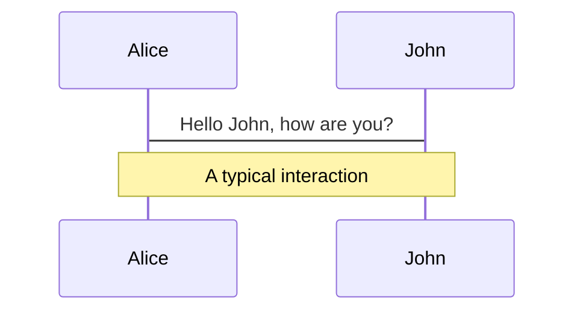
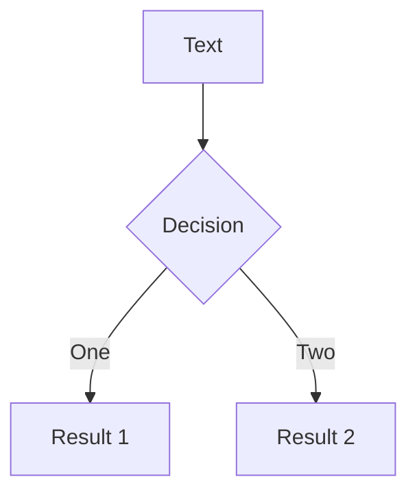
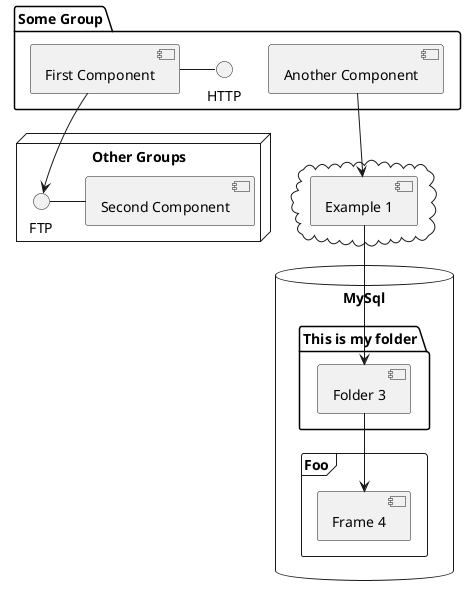

---
# try also 'default' to start simple
theme: seriph
themeConfig: '#41b883'
# random image from a curated Unsplash collection by Anthony
# like them? see https://unsplash.com/collections/94734566/slidev
background: https://source.unsplash.com/collection/94734566/1920x1080
# apply any windi css classes to the current slide
class: 'text-center'
# https://sli.dev/custom/highlighters.html
highlighter: shiki
# show line numbers in code blocks
lineNumbers: false
# some information about the slides, markdown enabled
info: |
  ## Slidev Starter Template
  Presentation slides for developers.

  Learn more at [Sli.dev](https://sli.dev)
# persist drawings in exports and build
drawings:
  persist: false
---
# Vue3 Virtual DOM 性能优化

<div>

[戴威@edison1105 / Vue.js team member ](https://github.com/edison1105) 

</div>

<div class="pt-12">
  <span @click="$slidev.nav.next" class="px-2 py-1 rounded cursor-pointer" hover="bg-white bg-opacity-10">
    Press Space for next page <carbon:arrow-right class="inline"/>
  </span>
</div>

---

# Virtual DOM 性能优化

- **组件的工作原理**
    - 编译阶段
    - 运行时
- **传统 Diff 算法** 
    - 性能的浪费
    - 思考如何优化
- **Virtual DOM 的重构**
    - 什么是 BlockTree
    - PatchFlags 的作用
- **Diff 算法的改进**
    - diff的整个流程 
    - 优化模式


---

# 组件的工作原理
<div class="flex">
<div class="flex-1">

- 编译阶段
  - Parse: 模板字符串 -> AST
  - Transform: 对 AST 进行转换
  - Generate: AST -> render 函数

</div>
<div class="flex-1 mx-10">

  template

  ```html
  <template>
    <div>{{ msg }}</div>
  </template>
  ```

  [AST](https://astexplorer.net/#/gist/8a0bd75dd94ca7093bde998a0dfccd43/c9e0e68e6f504a333180760ac227b8d88ab640bb)

  render function
    
  ```javascript
  function render(ctx) {
    return h('div', ctx.msg)
  }
  ```

</div>
</div>


---

# 组件的工作原理
<div class="flex">
<div class="flex-1">

  - 运行时
    - 数据响应式处理
    - render 阶段，render函数执行返回 VNode
    - mount 阶段，VNode 渲染成 HTML

</div>

<div class="flex-1 mx-10">

reactive
```javascript
new Proxy(ctx, {
  get(target, key, receiver) {/* 收集依赖 */},
  set(target, key, value, receiver) {/* 触发依赖 */}
})
```

render function
```javascript
function render(ctx) {
  return h('div', ctx.msg)
}
```

VNode
```javascript
const vnode = {
  tag:'div',
  children: [{ text: ctx.msg }]
}
```
</div>
</div>

---

# 组件的工作原理
  - 运行时
    - 响应式数据变化，render 函数重新执行，得到新的 VNode
    - patch 阶段：新、旧 VNode diff，更新 HTML

<div class="flex flex-row">
  <div class="flex-1">
  <div class="flex-1">

  old VNode
  ```javascript
  const vnode = {
    tag:'div',
    children: [{ text: 'hello' }]
  }
  ```
  </div>
  <div class="flex-1">

  new VNode
  ```javascript
  const newVNode = {
    tag:'div',
    children: [{ text: 'world' }]
  }
  ```
  </div>
  </div>
  <div class="flex-1 mt-30 mx-10px">
  
  new HTML

  ```html
  <div>world</div>
  ```

  </div>
</div>

---

# 传统 Diff 算法
  
<div class="flex">
  <div class="flex-1">
  template

  ```html
  <template>
    <div id="content">
      <p class="test">content</p>
      <p class="test">content</p>
      <p class="test">{{ msg }}</p>
      <p class="test">content</p>
      <p class="test">content</p>
    </div>
  </template>
  ```
  </div>
  <div class="flex-1 mx-20px">
  Diff 的过程

  - diff DIV
    - diff props of DIV
    - diff children of DIV
      - diff P (重复多次)
        - diff props of P
        - diff children of P
  </div>
</div>

<div class="mt-30px">

- diff 算法对比颗粒度是组件
- 遍历整个VNode，**深度优先，同层比较**
- 将差异 patch 到真实 DOM 上，减少回流与重绘

</div>
---

# 传统 diff 算法
- 存在性能损耗
  - 需要遍历整个 VNode
  - 静态不会变的节点也参与了 diff

```html {all|1-4,6-9}
  <template>
    <div id="content">
      <p class="test">content</p>
      <p class="test">content</p>
      <p class="test">{{ msg }}</p>
      <p class="test">content</p>
      <p class="test">content</p>
    </div>
  </template>
```

- 思考
  - 那么才能避免性能的浪费？
---

# Vue2 中的优化
Vue2为了向下兼容，采取了比较保守的做法：静态标记
<div class="flex flex-row">
  <div>
  
- 编译期标记静态节点

```javascript
var ast = parse(template.trim(), options);
if (options.optimize !== false) {
  //标记静态节点
  optimize(ast, options);
}
var code = generate(ast, options);
```
- render function
```javascript
{
  render() { return _m(0) },
  staticRenderFns: [function(){ return VNode }]
}
// renderStatic
_m = function (index) {
  const node = staticRenderFns[index]()
  node.isStatic = true
  return node
}

```

  </div>
  <div class="flex-1 mx-10">
  
  - 有哪些节点是静态的？
    - 节点类型是3(纯文本)
    - 节点使用了 v-pre
    - 其他满足以下条件的节点
      - 没有绑定的指令、事件等
      - 不包含v-if、v-for、v-else
      - 不是slot、component
      - 不是组件类型
      - 静态节点的祖先节点，不是带有 v-for 指令的 template 节点
      - 节点只包含staticClass,staticStyle + [基础属性](https://astexplorer.net/#/gist/51a08f2ce6aa6422d7794b7992e7b4da/f48e7715ca6b8feabc1e35ea6e85ba79c2f6903a)

  </div>
</div>

---

# Vue2 中的优化
- 优化后
  - patch 时跳过静态节点 diff
  - 但依然需要遍历整个VNode

```html {all|5}
  <template>
    <div id="content">
      <p class="test">content</p>
      <p class="test">content</p>
      <p class="test">{{ msg }}</p>
      <p class="test">content</p>
      <p class="test">content</p>
    </div>
  </template>
```

- 重新思考
  - 我们其实关心的是动态节点，并不关心静态节点。
  - 有没有办法像标记静态节点那样，找出动态节点，运行时只更新动态节点？
  - 标记动态节点，运行时收集起来，patch 时靶向更新
  - 结构会变化的时候，怎么收集动态节点
---

<!--
只更新动态节点跟不更新静态节点，其实是有区别的。
1）只更新动态节点可以不按照层级对比，因为在首次渲染之后我们已经将
el缓存到VNode上了，可以直接 patch。
-->

#  Vue3 中的优化
在编译阶段给动态节点标记增加 PatchFlag


<div class="flex flex-row">
  <div class="flex-1">

- template
```html {all|5}
  <template>
    <div id="content">
      <p class="test">content</p>
      <p class="test">content</p>
      <p class="test">{{ msg }}</p>
      <p class="test">content</p>
      <p class="test">content</p>
    </div>
    
  </template>
```

  </div>
  <div class="flex-1 mx-20px">

- render function
```javascript {all|6}
function render() {
  // 此处对代码进行了简化
  return createVNode('div',{ id: "content" }, [
    createVNode('p', { class: "test" }, 'content'),
    createVNode('p', { class: "test" }, 'content'),
    createVNode('p', { class: "test" }, this.msg, PatchFlags.TEXT),
    createVNode('p', { class: "test" }, 'content'),
    createVNode('p', { class: "test" }, 'content'),
  ])
}
```

  </div>
</div>


- [AST](https://astexplorer.net/#/gist/51a08f2ce6aa6422d7794b7992e7b4da/5e22b9e652d7a825b2e9c05327375e45805ff64a)
- PatchFlags 可以简单理解为一个枚举，每个枚举值有不同的含义
  - 1：动态的文本
  - 2：动态的 class
  - //...
---

#  Vue3 中的优化

<div class="flex flex-row">
  <div class="flex-1">

- render function
```javascript
function render() {
  // 此处对代码进行了简化
  return createVNode('div',{ id: "content" }, [
    createVNode('p', { /**/ }, 'content'),
    createVNode('p', { /**/ }, 'content'),
    createVNode('p', { /**/ }, this.msg, PatchFlags.TEXT),
    createVNode('p', { /**/ }, 'content'),
    createVNode('p', { /**/ }, 'content'),
  ])
}
```

  </div>
  <div class="flex-1 mx-20px">

  - VNode

  ```javascript {all|10-12}
  const vnode = {
    type: 'div',
    children: [
      { type: 'p', children: 'content' },
      { type: 'p', children: 'content' },
      { type: 'p', children: ctx.msg, patchFlag: 1 /* TEXT */ }, 
      { type: 'p', children: 'content' },
      { type: 'p', children: 'content' },
    ],
    dynamicChildren: [
      { type: 'p', children: ctx.msg, patchFlag: 1 /* TEXT */ }, 
    ]
  }
  ```

  </div>
</div>

- 在首次渲染时，可以通过一个数组，将动态节点收集起来
- 在 patch 时，就可以只 diff 动态节点
- 拥有 dynamicChildren 属性的 VNode，就是一个 Block

---

#  Vue3 中的优化

<div class="flex flex-row">
  <div class="flex-1">

- template
```html
<template>
  <div>
    <p class="test">{{ foo }}</p>
    <div>
      <span class="test">{{ bar }}</span>
    </div>
  </div>
</template>
```

  </div>
  <div class="flex-1 mx-20px">

  - VNode

  ```javascript {all}
  const vnode = {
    type: 'div',
    children: [
      { type: 'p', children: ctx.foo, patchFlag: 1 /* TEXT */ }, 
      { type: 'div', children: [
          { type: 'span', children: ctx.bar, patchFlag: 1 /* TEXT */ }
        ], 
      },
    ],
    dynamicChildren: [
      { type: 'p', children: ctx.foo, patchFlag: 1 /* TEXT */ },
      { type: 'span', children: ctx.bar, patchFlag: 1 /* TEXT */ } 
    ]
  }
  ```

  </div>
</div>

- dynamicChildren 是忽略层级的，会收集所有子代的动态节点（patch 时无需遍历整个 VNode）
- 什么样节点可以作为 Block?
---


#  Block 的特点
什么样的节点可以作为 Block?

<div class="flex flex-row">
  <div class="flex-1">
  
- template

```html
<template>
  <div>
    <p class="test">{{ foo }}</p>
    <div>
      <span class="test">{{ bar }}</span>
    </div>
  </div>
</template>
```

  </div>
  <div class="flex-1 mx-20px">

  - Block 的特点（节点的内部结构不会变化）
    - 子节点的数量不会变化
    - 子节点顺序不会变化
  
  </div>
</div>

- 有哪些操作为导致节点的内部结构发生变化
  - v-if 
  - v-for
---

#  节点的内部结构不稳定
v-if 节点作为 Block

<div class="flex flex-row">
  <div class="flex-1">
  
- template

```html
<template>
  <div>
    <div v-if="foo">
      <p>hello</p>
      <div>{{ bar }}</div>
    </div>
    <div v-else>
      <p>world</p>
      <div>{{ bar }}</div>
      <div>{{ baz }}</div>
    </div>
  </div>
</template>
```

  </div>
  <div class="flex-1 mx-20px">

  - Block
  
  ```javascript {all|3-6|7-11}
  const block = {// baz = true
    type: 'div',
    dynamicChildren:[
      { type: 'div',  children: ctx.bar, patchFlag: 1 /* TEXT */ },
    ]
  }
  const block = { // baz = false
    type: 'div',
    dynamicChildren:[
      { type: 'div',  children: ctx.bar, patchFlag: 1 /* TEXT */ },
      { type: 'div',  children: ctx.baz, patchFlag: 1 /* TEXT */ },
    ]
  }

  ```
  </div>
</div>

  - 当 v-if 的值发生变化的时候，动态节点的数量会不一致
  - 会导致 diff 不正确

---

#  v-if 节点作为 Block

<div class="flex flex-row">
  <div class="flex-1">
  
- template

```html
<template>
  <div>
    <div v-if="foo">
      <p>hello</p>
      <div>{{ bar }}</div>
    </div>
    <div v-else>
      <p>world</p>
      <div>{{ bar }}</div>
      <div>{{ baz }}</div>
    </div>
  </div>
</template>
```

  </div>
  <div class="flex-1 mx-20px">

  - Block
  
  ```javascript
  Block(div)
    - Block(div v-if)
    - Block(div v-else)

  const block = {
    type: 'div',
    dynamicChildren: [
      //  Block(v-if)
      { type: 'div', { key: 0 }, children:[...], dynamicChildren:[...] },
      //  Block(v-else)
      { type: 'div', { key: 1 }, children:[...], dynamicChildren:[...] },
    ]
  }
  ```
  </div>
</div>

- v-if,v-else 会有不同的key
- key 不相同，会进行 full diff（diff children）
- 多个 Block 嵌套，就构成了 Block Tree
---


#  v-for 节点作为 Block

<div class="flex flex-row">
  <div class="flex-1">
  
- template

```html
<template>
  <div>
    <div v-for="item in list">
      <span>title:</span>
      <span>{{ item }}</span>
    </div>
    <i>{{ foo }}</i>
  </div>
</template>
```

  </div>
  <div class="flex-1 mx-20px">

  - Block
  
  ```javascript
  // list = ['a', 'b']
  const block = [
    type: 'div',
    dynamicChildren:[
      { type: 'span', children: 'a', patchFlag: 1 /* TEXT */},
      { type: 'span', children: 'b', patchFlag: 1 /* TEXT */},
      { type: 'i', children: ctx.foo, patchFlag: 1 /* TEXT */},
    ]
  ]
  // list = ['a']
  const block = [
    type: 'div',
    dynamicChildren:[
      { type: 'span', children: 'a', patchFlag: 1 /* TEXT */},
      { type: 'i', children: ctx.foo, patchFlag: 1 /* TEXT */},
    ]
  ]
  ```
  </div>
</div>

- 动态节点的数量不一致，怎么 diff?
    - 能将 dynamicChildren 进行传统 diff?

---


<!--
如果节点的内部结构不会发生变化，只需要更新动态节点就行了。
对于这样内部结构不变的节点，我们作为一个单元，提取其中的动态节点。
相反，如果节点的内部结构是会变化的，那么就需要对整个VNode的children进行对比。
-->

# Virtual DOM 的重构
模板的好处
什么是Block
Block 跟 children的关系

- 大多数时候我们写的代码都是动态的，所以静态标记优化是有限的。
- 仍然要遍历整个 VNode 节点
- 反向思考，如何找动态节点。

---

# 什么样的节点可以作为 Block
结构稳定的节点

---

# 结构稳定的Fragment
    - v-for 表达式是常量
---

# 结构稳定的Fragment
    - 多个根元素
---

# 结构稳定的Fragment
    - 插槽出口
---

# 结构稳定的Fragment
    - template v-for
---

# 结构不稳定的节点
    - v-if
    - v-for

---

# v-if 节点作为Block
截图分析

---

# v-for 节点作为Block
Fragment
截图分析

---

# 属性的优化 PatchFlags
    - class
```typescript
export const enum PatchFlags {
  TEXT = 1 ,  // 动态文本节点
  CLASS = 1 << 1,  // 2   动态class
  STYLE = 1 << 2,  // 4   动态style
  PROPS = 1 << 3,  // 8   除去class/style以外的动态属性
  FULL_PROPS = 1 << 4,       // 16  有动态key属性的节点，当key改变时，需进行完整的diff比较
  HYDRATE_EVENTS = 1 << 5,   // 32  有监听事件的节点
  STABLE_FRAGMENT = 1 << 6,  // 64  一个不会改变子节点顺序的fragment (一个组件内多个根元素就会用fragment包裹)
  KEYED_FRAGMENT = 1 << 7,   // 128 带有key属性的fragment或部分子节点有key
  UNKEYEN_FRAGMENT = 1 << 8, // 256  子节点没有key的fragment
  NEED_PATCH = 1 << 9,       // 512  一个节点只会进行非props比较
  DYNAMIC_SLOTS = 1 << 10,   // 1024   动态slot
  HOISTED = -1,  // 静态节点 
  BAIL = -2      // 表示 Diff 过程中不需要优化
}
```

---

# PatchFlags
    - STYLE

---

# PatchFlags
    - PROPS

---


# diff 的优化
    dynamicChildren 

---

# diff 的优化
    dynamicProps 
 
---


# Navigation

Hover on the bottom-left corner to see the navigation's controls panel, [learn more](https://sli.dev/guide/navigation.html)

### Keyboard Shortcuts

|     |     |
| --- | --- |
| <kbd>right</kbd> / <kbd>space</kbd>| next animation or slide |
| <kbd>left</kbd>  / <kbd>shift</kbd><kbd>space</kbd> | previous animation or slide |
| <kbd>up</kbd> | previous slide |
| <kbd>down</kbd> | next slide |

<!-- https://sli.dev/guide/animations.html#click-animations -->

<p v-after class="absolute bottom-23 left-45 opacity-30 transform -rotate-10">Here!</p>

---
layout: image-right
image: https://source.unsplash.com/collection/94734566/1920x1080
---

# Code

Use code snippets and get the highlighting directly![^1]

```ts {all|2|1-6|9|all}
interface User {
  id: number
  firstName: string
  lastName: string
  role: string
}

function updateUser(id: number, update: User) {
  const user = getUser(id)
  const newUser = {...user, ...update}  
  saveUser(id, newUser)
}
```

<arrow v-click="3" x1="400" y1="420" x2="230" y2="330" color="#564" width="3" arrowSize="1" />

[^1]: [Learn More](https://sli.dev/guide/syntax.html#line-highlighting)

<style>
.footnotes-sep {
  @apply mt-20 opacity-10;
}
.footnotes {
  @apply text-sm opacity-75;
}
.footnote-backref {
  display: none;
}
</style>

---

# Components

<div grid="~ cols-2 gap-4">
<div>

You can use Vue components directly inside your slides.

We have provided a few built-in components like `<Tweet/>` and `<Youtube/>` that you can use directly. And adding your custom components is also super easy.

```html
<Counter :count="10" />
```

<!-- ./components/Counter.vue -->
<Counter :count="10" m="t-4" />

Check out [the guides](https://sli.dev/builtin/components.html) for more.

</div>
<div>

```html
<Tweet id="1390115482657726468" />
```

<Tweet id="1390115482657726468" scale="0.65" />

</div>
</div>


---
class: px-20
---

# Themes

Slidev comes with powerful theming support. Themes can provide styles, layouts, components, or even configurations for tools. Switching between themes by just **one edit** in your frontmatter:

<div grid="~ cols-2 gap-2" m="-t-2">

```yaml
---
theme: default
---
```

```yaml
---
theme: seriph
---
```


</div>

Read more about [How to use a theme](https://sli.dev/themes/use.html) and
check out the [Awesome Themes Gallery](https://sli.dev/themes/gallery.html).

---
preload: false
---

# Animations

Animations are powered by [@vueuse/motion](https://motion.vueuse.org/).

```html
<div
  v-motion
  :initial="{ x: -80 }"
  :enter="{ x: 0 }">
  Slidev
</div>
```

<div class="w-60 relative mt-6">
  <div class="relative w-40 h-40">
    
    
    
  </div>

  <div
    class="text-5xl absolute top-14 left-40 text-[#2B90B6] -z-1"
    v-motion
    :initial="{ x: -80, opacity: 0}"
    :enter="{ x: 0, opacity: 1, transition: { delay: 2000, duration: 1000 } }">
    Slidev
  </div>
</div>

<!-- vue script setup scripts can be directly used in markdown, and will only affects current page -->
<script setup lang="ts">
const final = {
  x: 0,
  y: 0,
  rotate: 0,
  scale: 1,
  transition: {
    type: 'spring',
    damping: 10,
    stiffness: 20,
    mass: 2
  }
}
</script>

<div
  v-motion
  :initial="{ x:35, y: 40, opacity: 0}"
  :enter="{ y: 0, opacity: 1, transition: { delay: 3500 } }">

[Learn More](https://sli.dev/guide/animations.html#motion)

</div>

---

# LaTeX

LaTeX is supported out-of-box powered by [KaTeX](https://katex.org/).

<br>

Inline $\sqrt{3x-1}+(1+x)^2$

Block
$$
\begin{array}{c}

\nabla \times \vec{\mathbf{B}} -\, \frac1c\, \frac{\partial\vec{\mathbf{E}}}{\partial t} &
= \frac{4\pi}{c}\vec{\mathbf{j}}    \nabla \cdot \vec{\mathbf{E}} & = 4 \pi \rho \\

\nabla \times \vec{\mathbf{E}}\, +\, \frac1c\, \frac{\partial\vec{\mathbf{B}}}{\partial t} & = \vec{\mathbf{0}} \\

\nabla \cdot \vec{\mathbf{B}} & = 0

\end{array}
$$

<br>

[Learn more](https://sli.dev/guide/syntax#latex)

---

# Diagrams

You can create diagrams / graphs from textual descriptions, directly in your Markdown.

<div class="grid grid-cols-3 gap-10 pt-4 -mb-6">







</div>

[Learn More](https://sli.dev/guide/syntax.html#diagrams)


---
layout: center
class: text-center
---

# Learn More

[Documentations](https://sli.dev) · [GitHub](https://github.com/slidevjs/slidev) · [Showcases](https://sli.dev/showcases.html)
